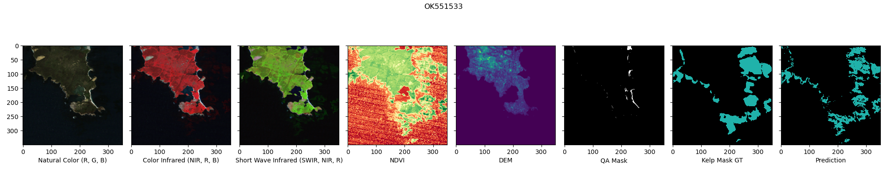

# III. Model documentation and write-up

## 1. Who are you (mini-bio) and what do you do professionally? If you are on a team, please complete this block for each member of the team

ML Engineer specializing in building Deep Learning solutions for Geospatial industry in a cloud native fashion. Combining deep and practical understanding of technology, computer vision and AI with experience in big data architectures. A data geek by heart.

## 2. What motivated you to compete in this challenge?

My motivation to compete in the Kelp Wanted Competition stemmed from a confluence of professional interest and personal commitment to environmental sustainability. As an ML Engineer with a focus on geospatial analytics and deep learning, I am always on the lookout for challenges that push the boundaries of what's possible with AI in the realm of Earth observation and environmental monitoring. This competition represented a unique opportunity to apply my skills towards a cause that has profound implications for biodiversity, climate change mitigation, and the well-being of coastal communities worldwide.

## 3. High level summary of your approach: what did you do and why?

In the end I managed to create two submissions, both employing an ensemble of models trained across all 10-fold cross-validation (CV) splits, optimized to achieve a private leaderboard (LB) score of **0.7318**.

### Initial Data Processing and Baseline Model

Initial step involved thorough exploratory data analysis (EDA) to understand the dataset's characteristics. I identified unique challenges, such as the absence of Coordinate Reference System (CRS) information and the presence of "duplicates" in the validation set. I established a baseline using a UNet architecture combined with a ResNet-50 encoder, trained on a 10-fold stratified CV split. This model used a combination of base spectral bands and single additional spectral index - the NDVI. Z-score normalization was applied to the input data. This baseline model achieved a public LB score of 0.6569.

### De-duplication and Robust CV Split

To address the issue of duplicates, I generated embeddings for each image's DEM layer using a pre-trained ResNet network, grouping images with high cosine similarity. This de-duplication process led to a more robust CV split strategy, ensuring that the model was trained and validated on unique Area of Interest (AOI) groups. This gave me confidence that the model will generalize well.

### Training details

The utilization of pre-trained weights laid a strong foundation, allowing the models to learn from relevant, pre-existing patterns, significantly accelerating the learning process. The introduction of the Normalized Difference Vegetation Index (NDVI) and other spectral indices such as ATSAVI, AVI, CI, and more, provided the models with enhanced capabilities to distinguish between kelp and non-kelp regions effectively. These indices, especially when coupled with strategy of reordering channels to align more closely with natural and scientific observations, significantly improved model performance.

Decision to employ AdamW optimizer, accompanied by a carefully chosen weight decay and learning rate scheduler, further optimized the training process, striking a fine balance between fast convergence and avoiding overfitting. The choice of a 32 batch size fully leveraged the computational capacity of the Tesla T4 GPUs, ensuring efficient use of resources.

The implementation of mixed-precision training and inference not only reduced model's memory footprint but also accelerated its computational speed, making the solution both effective and efficient. By adopting a weighted sampler with a tailored importance factor for each type of pixel, the models could focus more on significant areas, reducing the bias towards dominant classes.

The UNet architecture, augmented with an EfficientNet-B5 encoder, proved to be the best combination for the task, striking a balance between accuracy and computational efficiency. Adjusting the decision threshold allowed me to fine-tune the model's sensitivity to kelp presence, which was crucial for achieving high evaluation scores.

### Ensemble Strategy and Final Touches

Both of my top submissions were ensembles of models trained on diversified data splits, with specific attention to model weights and decision thresholds to optimize performance. TTA did not work for the public leaderboard. I opted to only optimize the individual model weights, soft labels usage and final decision threshold.

## 4. Do you have any useful charts, graphs, or visualizations from the process?

### Duplicated AOIs

After it became apparent that there are "duplicates" in the validation datasets - images captured from different orbits, different platforms or at different times a need for more robust train-test split arose. You can view sample of "duplicated" images below (DEM layer).


You can see that the same Area of Interest is presented on those images. In order to create robust CV split strategy each DEM layer was used for embedding generation. DEM layer was chosen for AOI grouping since it does not contain any striping artifacts, corrupted or saturated pixels or clouds. Missing values in this layer mark the extent of the DEM layer i.e. DEM only goes couple hundred of meters into the sea - there is no point in calculating DEM over the water. Missing values were replaced with zeroes. Every DEM image was passed through a pre-trained ResNet network. The resulting embeddings were then compared  with each other - if cosine similarity between two images was over 0.97 they were placed into a single group. The de-duplication resulted in 3313 unique AOI groups. Those groups where then used to perform 10-Fold Stratified CV Split.

### Corrupted images

What's more a few images had been mislabelled as kelp. Those images were filtered out from the training dataset.


### Best spectral index combinations

The best models all used 17 extra spectral indices appended to the input tensor of **R, G, B, SWIR, NIR, QA, DEM** bands:
**DEMWM, NDVI, ATSAVI, AVI, CI, ClGreen, GBNDVI, GVMI, IPVI, KIVU, MCARI, MVI, NormNIR, PNDVI, SABI, WDRVI, mCRIG**.


### Azure ML Jobs

Various Model architectures and encoders were tested to find the best performing ones. Azure ML Sweep Job was used to verify encoder + architecture pairs. The encoders came from both [segmentation-models-pytorch](https://github.com/qubvel/segmentation_models.pytorch) and [timm](https://github.com/huggingface/pytorch-image-models) libraries. A sample job results are visible below.


Using Azure ML for running experiments allowed me to run more jobs in shorter amount of time.Scheduling 100s of experiments at a time was exhilarating.

## 5. Copy and paste the 3 most impactful parts of your code and explain what each does and how it helped your model

### AOI grouping

The code snippet presents a function that calculates the per-image embeddings and calculates cosine similarity between each image pairs. If similarity between two images is over the specified threshold the images are placed in the same group. This was a pivotal idea necessary for creating a robust K-Fold Cross Validation splits.

```python
def find_similar_images(
    data_folder: Path,
    tile_ids: List[str],
    threshold: float = 0.95,
    batch_size: int = 32,
    num_workers: int = 6,
) -> List[List[str]]:
    """
    Finds similar images in specified data folder.

    Args:
        data_folder: The data folder with input images.
        tile_ids: A list of Tile IDs for corresponding images.
        threshold: The similarity threshold to use when comparing individual image pairs.
        batch_size: Batch size to use when generating embeddings.
        num_workers: Number of worker processes to use when generating embeddings.

    Returns: A list of similar images.

    """
    features, dataset = generate_embeddings(
        data_folder=data_folder,
        tile_ids=tile_ids,
        batch_size=batch_size,
        num_workers=num_workers,
    )
    groups = calculate_similarity_groups(
        dataset=dataset,
        features=features,
        threshold=threshold,
    )
    return groups
```

### Submission previews

Hands down, plotting few sample predictions after running submission file generation was the best idea I had during this competition. At the beginning I wasted a few submissions because I did not take time to verify the predictions. Having automated way of plotting a few samples each time I made a submission was a lifesaver.

```python
def plot_first_n_samples(data_dir: Path, submission_dir: Path, output_dir: Path, n: int = 10) -> None:
    """
    Plots first N samples from the submission directory.

    Args:
        data_dir: The path to the data directory with files used to generate predictions in the submission dir.
        submission_dir: The path to the submission directory.
        output_dir: The path to the output directory.
        n: The number of samples to plot.

    """
    output_dir.mkdir(exist_ok=True, parents=True)
    for fp in tqdm(sorted(list(data_dir.glob("*.tif")))[:n], "Plotting predictions"):
        tile = fp.stem.split("_")[0]
        with rasterio.open(data_dir / f"{tile}_satellite.tif") as src:
            input = src.read()
        with rasterio.open(submission_dir / "predictions" / f"{tile}_kelp.tif") as src:
            prediction = src.read(1)
        fig = plot_sample(
            input_arr=input,
            predictions_arr=prediction,
            suptitle=tile,
        )
        fig.savefig(output_dir / f"{fp.stem}.png")
        plt.close(fig)
```

### 10-Fold cross validation prediction with Makefile

Implementing single command for running inference with model Ensemble was also crucial. Without it, I would need to run the `predict.py` script individually for each fold. Running it manually would greatly increase change for bugs and typos.

```shell
make cv-predict
```

## 6. Please provide the machine specs and time you used to run your model

For running quick experiments, data preparation, training models and making submissions a local PC with Ubuntu 22.04 was used. This machine was the only one used to make submission files.

Specs:

* OS: Ubuntu 22.04
* Python 3.10 environment with PyTorch 2.1.2 and CUDA 12.1
* CPU: 8-Core AMD Ryzen 7 2700X
* RAM: 32 GB RAM
* Disk: 2 TB SSD
* GPU: RTX 3090 with 24 GB VRAM

Larger training jobs and hyperparameter optimization sweeps were performed on Azure ML using following spot instances:

* **Standard_NC4as_T4_v3**:
  * Ubuntu 20.04 docker image
  * Python 3.8 environment with PyTorch 2.1.2 and CUDA 12.1 (Azure base image forces py38 usage)
  * 4 cores
  * 28 GB RAM
  * 176 GB disk
  * Tesla T4 GPU with 16 GB VRAM
* **Standard_NC24ads_A100_v4**:
  * Ubuntu 20.04 docker image
  * Python 3.8 environment with PyTorch 2.1.2 and CUDA 12.1 (Azure base image forces py38 usage)
  * 24 cores
  * 220 GB RAM
  * 64 GB disk
  * A100 GPU with 80 GB VRAM

Time needed for training and inference of the final model ensemble:

* Train duration:
  * ~6-7h per model - Tesla T4
  * ~2h - A100
* Inference duration: ~4 min

## 7. Anything we should watch out for or be aware of in using your model (e.g. code quirks, memory requirements, numerical stability issues, etc.)?

The code is deterministic. The best submissions can be replicated easily using Makefile commands. For training the average node utilization is shown in a screenshot below:


Detailed CPU and GPU utilization graphs are presented below:


Running inference requires significantly less memory for the CPU and GPU since we don't need to calculate any gradients.

## 8. Did you use any tools for data preparation or exploratory data analysis that aren’t listed in your code submission?

Used [QGIS](https://qgis.org/en/site/) from time to time, but since the images lack CRS information it hasn't been useful very much.

## 9. How did you evaluate performance of the model other than the provided metric, if at all?

During the training loop following metrics are logged:

* `train/loss`
* `train/dice`
* `val/loss`
* `val/dice`
* `val/iou`
* `val/iou_kelp`
* `val/iou_background`
* `val/accuracy`
* `val/precision`
* `val/f1`
* `test/loss`
* `test/dice`
* `test/iou`
* `test/iou_kelp`
* `test/iou_background`
* `test/accuracy`
* `test/precision`
* `test/f1`

Visual prediction inspection during training was also used - after each epoch the model predictions for first few batches were logged.

* Ground Truth Mask


* Epoch #0


* Epoch #1


* Epoch #2


* Epoch #5


* Epoch #10


Confusion matrices are logged too:


### 10. What are some other things you tried that didn’t necessarily make it into the final workflow (quick overview)?

**SAHI**

Slicing Aided Hyper Inference or SAHI is a technique that helps overcome the problem with detecting and segmenting small objects in large images by utilizing inference on image slices and prediction merging. Because of this it is slower than running inference on full image but at the same time usually ends up having better performance, especially for smaller features.

The idea was simple:

1. Generate sliced dataset of small 128x128 non-overlapping tiles from the bigger 350x350 input images
2. Use this dataset to train new model
3. During training resize the crops to e.g. 320x320 resolution and train on those
4. When running inference generate overlapping tiles, inference on those tiles, and merge the predicted masks
   by averaging the predictions in the overlapping areas

Best model trained on **128x128** crops with **320x320 resize** and **nearest interpolation** resulted in public LB score of: **0.6848**. As it turns out, the input time size of 350x350 is already too small for SAHI to shine. Sliced inference did not result in any meaningful bump in performance.

**XGBoost**

Another idea that did not work was training XGBoost Classifier on all channels and spectral indices. The goal was not to use XGBoost to establish channel and spectral index importance, but rather completely replace the deep learning approach with classical tree-based model. Unfortunately best models on public LB had score of 0.5125. Which was way too low to try to optimize. Since predictions are done per pixel, TTA cannot be usd. Optimizing decision threshold did not improve the scores much. Even applying post-processing operations such as erosion or dilution would not bump the performance by 20 p.p.

Sample predictions:



Other, things that I tried that didn't work included:

* Training from scratch
* Larger or smaller `weight_decay` (best was 1e-4)
* Larger or smaller `lr` (best was 3e-4)
* `decoder_attention_type="scse"`
* Losses other than DICE (CE with weighting was close)
* Compiling the model and `torch-ort`
* Normalization strategies other than `quantile` / `z-score`
* Bunch of different index combinations
* TTA (for leaderboard, locally it did sometimes bump by scores)
* LR Schedulers other than `OneCycleLR`
* Using Random split
* More decoder channels
* Resize strategy different than `pad`
* Training with larger images
* Bigger batches
* More frequent val checks
* Smaller batch sizes and `accumulate_grad_batches` > 1
* Stochastic Weights Averaging (SWA)

## 11. If you were to continue working on this problem for the next year, what methods or techniques might you try in order to build on your work so far? Are there other fields or features you felt would have been very helpful to have?

I'd definitely would try more models pre-trained on remote sensing data.

* [Prithvi-100M](https://huggingface.co/ibm-nasa-geospatial/Prithvi-100M)
* [The Pretrained Remote Sensing Transformer (Presto)](https://github.com/nasaharvest/presto)

As well as transformer based models such as:

* [Swin transformer](https://arxiv.org/abs/2103.14030)
* [SegFormer](https://arxiv.org/abs/2105.15203)

Would also like to leverage external data such as Sentinel-1 and 2 or Harmonized Landsat and Sentinel.

## 12. What simplifications could be made to run your solution faster without sacrificing significant accuracy?

Exporting the model to ONNX or compiling it using JIT is a viable option. Also refactoring the inference so that the predictions are not kept in memory during the averaging step could be beneficial for systems with limited memory.
